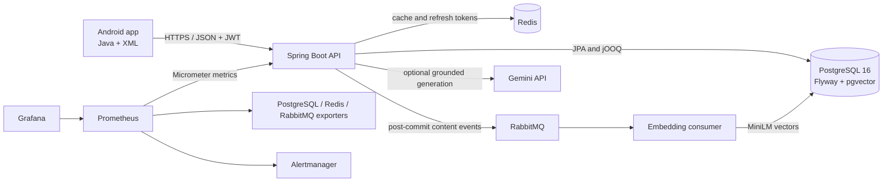

# EduFlex

EduFlex is a full-stack mobile learning platform built as a native Android application with a Spring Boot backend. Learners can discover and enroll in courses, study lessons, complete quizzes, track progress, collect XP and badges, maintain streaks, join a leaderboard, review courses, and use grounded AI course assistance. Administrators can manage users, courses, lessons, and quizzes.

The project demonstrates production-oriented backend design as well as mobile UI work: transactional concurrency control, PostgreSQL and pgvector, Redis caching, RabbitMQ background processing, JWT security, schema migrations, containerized infrastructure, integration testing, CI, and a provisioned Prometheus/Grafana monitoring stack.

## Engineering highlights

- Native Android client written in Java with XML layouts, Material 3, Navigation Component, Retrofit, View Binding, WorkManager, Glide, and optional Firebase Cloud Messaging.
- Spring Boot 3 REST API organized into controller, service, repository, security, configuration, and monitoring layers.
- PostgreSQL 16 is the system of record; Flyway owns schema evolution and jOOQ supports type-safe SQL where direct database control is useful.
- Redis provides purpose-specific caches and revocable refresh-token storage.
- RabbitMQ decouples course and lesson writes from embedding regeneration.
- Local MiniLM embeddings and pgvector retrieval ground optional Gemini summaries and answers in stored course content.
- Row locking, conditional state transitions, unique constraints, and transaction boundaries protect progress and reward data from duplicate concurrent requests.
- Micrometer, Prometheus, Grafana, Alertmanager, Blackbox Exporter, and database/cache exporters provide application and infrastructure visibility.
- Testcontainers runs the real PostgreSQL/pgvector schema and concurrency tests in CI.

## System architecture



Course or lesson changes commit before an event is published. The RabbitMQ consumer then regenerates semantic-search embeddings and invalidates affected caches. If no Gemini key is configured, semantic retrieval still works and the API returns deterministic summary and course-material suggestions.

## Product capabilities

| Area | Implemented capabilities |
| --- | --- |
| Accounts | Registration, login, password recovery, profile updates, access-token refresh, logout, and role-based access |
| Course discovery | Catalog, categories, search, course details, reviews, AI summaries, and grounded questions |
| Learning | Enrollment, lesson playback, saved lesson progress, continue-learning state, multiple-choice and fill-in-the-blank quizzes |
| Gamification | XP, levels, daily check-in, streaks, daily quests, badges, course-completion rewards, and leaderboard |
| Commerce | Cart, payment records, and paid-course enrollment flow |
| Administration | User removal and course, lesson, and quiz management behind the `ADMIN` role |
| Engagement | Local WorkManager study reminders and optional Firebase push notifications |
| UX resilience | Loading, empty, retry, validation, and offline/failure states on data-driven learner screens |

## Technology stack

| Layer | Technologies |
| --- | --- |
| Android | Java 17, XML layouts, Android SDK 35, Material 3, AppCompat, ConstraintLayout, Navigation Component, View Binding |
| Mobile networking and background work | Retrofit 2, OkHttp, Gson, WorkManager, Glide, Firebase Messaging when configured |
| Backend | Java 17+, Spring Boot 3.4, Spring Web, Spring Security, Bean Validation, Lombok, Springdoc OpenAPI |
| Persistence | PostgreSQL 16, pgvector, Spring Data JPA, jOOQ, Flyway, HikariCP |
| Caching | Redis, Spring Cache, cache statistics, per-domain TTLs |
| Messaging | RabbitMQ, Spring AMQP, direct exchange, durable queue, retry and processing metrics |
| AI and semantic search | LangChain4j MiniLM embeddings, pgvector cosine search, optional Gemini `gemini-2.0-flash` generation |
| Observability | Spring Boot Actuator, Micrometer, Prometheus, Grafana, Alertmanager, Blackbox Exporter, PostgreSQL/Redis/RabbitMQ exporters |
| Testing | JUnit, Spring Boot Test, Spring Security Test, Testcontainers with PostgreSQL/pgvector |
| Delivery | Gradle 8 / Android Gradle Plugin 8.5, Maven Wrapper, Docker Compose, GitHub Actions |

## Repository layout

```text
.
├── app/                         # Native Android application
│   └── src/main/
│       ├── java/...             # Activities, fragments, adapters, API clients and models
│       └── res/                 # XML layouts, navigation, Material theme and resources
├── backend/
│   ├── src/main/java/...        # API controllers, services, repositories and security
│   ├── src/main/resources/
│   │   └── db/migration/        # Versioned Flyway SQL migrations
│   ├── monitoring/              # Prometheus, Grafana, Alertmanager and exporter config
│   ├── scripts/                 # Operational verification scripts
│   ├── docker-compose.yml       # API, PostgreSQL, Redis and RabbitMQ
│   └── docker-compose.monitoring.yml
├── docs/                        # Monitoring and reliability documentation
├── .github/workflows/verify.yml # CI verification and build artifacts
└── README.md
```

## Backend design

### API and persistence

The REST API exposes resources under `/api` for authentication, users, courses, lessons, enrollment, progress, quizzes, payments, reviews, media, gamification, and administration. Interactive API documentation is available while the backend is running:

- Swagger UI: <http://localhost:8080/swagger-ui/index.html>
- OpenAPI JSON: <http://localhost:8080/v3/api-docs>

PostgreSQL is the authoritative data store. The schema includes accounts, course content, quiz data, enrollments, lesson progress, payments, reviews, gamification statistics, badges, daily quests, refresh-token related state, and vector embeddings. Flyway applies all migrations at startup, while Hibernate uses `ddl-auto=validate` so entity drift fails early instead of modifying production schemas implicitly.

Normal Maven builds use checked-in jOOQ sources and do not contact a development database. After changing the database schema, regenerate them explicitly against a configured PostgreSQL instance:

```bash
cd backend
./mvnw -Djooq.codegen.skip=false generate-sources
```

### Authentication and authorization

- Spring Security runs statelessly with signed JWT bearer tokens.
- Passwords are hashed with BCrypt.
- Fifteen-minute access tokens are paired with 30-day refresh tokens that can be revoked in Redis during logout.
- Route rules protect authenticated APIs and restrict `/api/admin/**` plus privileged mutations to the `ADMIN` role.
- Learning mutations validate the authenticated learner and resource ownership.
- The API returns explicit `401 Unauthorized` and `403 Forbidden` responses.
- Actuator metrics use a separate management listener in the monitoring profile and are not exposed through the public API port.

Keep `JWT_SECRETKEY`, database credentials, Redis/RabbitMQ passwords, Supabase secrets, Gemini keys, Firebase configuration, and release signing keys out of version control.

### Caching

Spring Cache stores frequently read and computationally expensive results in Redis. Cache entries use TTLs based on how quickly each domain changes:

| Cache group | Default TTL |
| --- | ---: |
| Courses and lessons | 5 minutes |
| Quizzes | 10 minutes |
| Leaderboard | 1 minute |
| User statistics | 2 minutes |
| Badge catalog | 30 minutes |
| User badges | 5 minutes |
| Reviews | 3 minutes |
| Course catalog | 5 minutes |
| AI summaries | 6 hours |
| Semantic search | 15 minutes |

Content mutations evict related entries, and embedding events invalidate semantic and summary caches after asynchronous processing. Redis cache statistics are enabled for monitoring.

### Messaging and asynchronous work

Course and lesson services publish content-change events to RabbitMQ after their database transactions commit. A durable embedding queue processes those events outside the request path, creates local MiniLM vectors, writes them to PostgreSQL through pgvector, and refreshes dependent cache state. Consumer prefetch is limited to 10 and listener retry is configured for three attempts.

The publisher records success and failure metrics. A publish failure does not roll back a content write that has already committed, so production deployments should monitor the failure alert and replay affected content; an outbox is a possible future durability improvement.

### Concurrency and data integrity

Progress, enrollment, and reward services are designed for retries and simultaneous requests:

- PostgreSQL `SELECT ... FOR UPDATE` serializes updates to a learner's gamification state.
- Conditional updates make lesson completion, first-pass quiz rewards, course completion, quest completion, enrollment, and badge assignment idempotent.
- Database uniqueness constraints provide a final duplicate-write boundary.
- Transaction ordering keeps progress and reward state consistent and rolls all related changes back on failure.
- Integration tests issue up to 100 concurrent requests against a real PostgreSQL/pgvector container.

Quiz submissions intentionally create attempts and do not yet accept a client idempotency key. Clients should avoid blindly replaying a submission after an ambiguous network timeout.

### AI retrieval flow

1. Course and lesson text is converted to local `all-MiniLM-L6-v2` embeddings.
2. Embeddings are stored in PostgreSQL using pgvector.
3. A learner question is embedded and matched against relevant lesson chunks.
4. Retrieved content becomes the context for optional Gemini generation.
5. The response includes its course sources so the mobile UI can show where an answer came from.

`GEMINI_API_KEY` is optional and remains backend-only. With no key, course summaries and suggestions use deterministic local fallbacks.

## Android application

The Android client remains native Java with XML layouts. Activities own the authentication and top-level flows; fragments implement Home, Discover, My Learning, course details, lessons, quizzes, AI assistance, reviews, payments, gamification, profile, certificates, and administration. Navigation Component preserves screen routes, View Binding provides type-safe view access, and Retrofit service interfaces map the backend domains.

`API_BASE_URL` is injected into `BuildConfig` at build time and must end with `/`. The default is `http://10.0.2.2:8080/`, which reaches the host machine from the standard Android emulator. Use your computer's LAN address for a physical device.

Firebase is optional. Adding an untracked `app/google-services.json` enables Firebase Messaging locally; clean clones and CI still build without it. WorkManager-based local study reminders do not require Firebase.

## Local development

### Prerequisites

- JDK 17 or 21
- Docker Desktop or Docker Engine with Compose v2
- Android Studio or Android SDK 35 with Build Tools 34.0.0
- An Android emulator or device for running the app

Configure the Android SDK through an untracked `local.properties` file containing `sdk.dir=...`, or through the standard Android SDK environment variables.

### Environment configuration

```bash
cp .env.example .env
cp backend/.env.example backend/.env
```

The root `.env` controls the Android base URL. `backend/.env` contains backend and Compose settings:

| Variable | Purpose | Required locally |
| --- | --- | --- |
| `API_BASE_URL` | Android API endpoint ending in `/` | No; emulator default exists |
| `POSTGRES_DB`, `POSTGRES_USER`, `POSTGRES_PASSWORD` | Local Compose database | Defaults exist; change passwords |
| `SPRING_DATASOURCE_URL`, `SPRING_DATASOURCE_USERNAME`, `SPRING_DATASOURCE_PASSWORD` | Direct backend database connection | Yes when running outside Compose |
| `JWT_SECRETKEY` | JWT signing key | Yes; set a strong secret |
| `JWT_EXPIRATION_MS` | Legacy compatibility property; current token lifetimes are fixed in `JwtUtils` | No |
| `REDIS_PASSWORD` | Redis authentication | Defaults exist; change outside disposable local use |
| `RABBITMQ_USERNAME`, `RABBITMQ_PASSWORD` | Broker authentication | Defaults exist; change passwords |
| `SUPABASE_URL`, `SUPABASE_PUBLISHABLE_KEY`, `SUPABASE_SECRET_KEY` | Optional media storage | Only for Supabase-backed uploads |
| `GEMINI_API_KEY`, `GEMINI_MODEL` | Optional grounded text generation | No |
| `EDUFLEX_TIME_ZONE` | Daily rewards calendar; defaults to `Asia/Ho_Chi_Minh` | No |
| `GRAFANA_ADMIN_USER`, `GRAFANA_ADMIN_PASSWORD` | Local Grafana login | Monitoring only |
| `POSTGRES_MONITOR_PASSWORD` | Least-privilege exporter account | Monitoring only |
| `EDUFLEX_ENVIRONMENT` | Monitoring dashboard environment label | No; defaults to `local` |

### Start the full application backend

From the repository root:

```bash
docker compose --env-file backend/.env -f backend/docker-compose.yml up --build -d
```

This starts the API on <http://localhost:8080>, PostgreSQL and pgvector, Redis, and RabbitMQ. The RabbitMQ management console is available at <http://localhost:15672> using the configured broker credentials.

Check readiness and follow logs:

```bash
curl --fail http://localhost:8080/readyz
docker compose --env-file backend/.env -f backend/docker-compose.yml logs -f eduflex-api
```

Stop the stack while preserving data:

```bash
docker compose --env-file backend/.env -f backend/docker-compose.yml down
```

Add `--volumes` only when you intentionally want to delete local PostgreSQL and Redis data.

### Run the backend directly

Start PostgreSQL, Redis, and RabbitMQ, configure `backend/.env`, then run:

```bash
cd backend
./mvnw spring-boot:run
```

The Supabase integration can be checked at `GET http://localhost:8080/api/supabase/health` when its settings are configured.

### Build and run Android

Open the repository root in Android Studio, wait for Gradle sync, select an emulator or device, and run the `app` configuration. From the command line:

```bash
./gradlew --no-daemon :app:assembleDebug
./gradlew --no-daemon :app:installDebug
```

If a stale Gradle process holds a lock, run `./gradlew --stop`. An isolated cache can help diagnose local cache problems:

```bash
GRADLE_USER_HOME=/tmp/eduflex-gradle-home ./gradlew --no-daemon :app:assembleDebug
```

## Monitoring and operations

The optional monitoring overlay runs the API with its monitoring profile and adds seven Prometheus scrape targets, three provisioned Grafana dashboards, alert evaluation, infrastructure exporters, and an HTTP readiness probe.

```bash
docker compose --env-file backend/.env \
  -f backend/docker-compose.yml \
  -f backend/docker-compose.monitoring.yml up --build -d
```

| Service | Local URL | Purpose |
| --- | --- | --- |
| Grafana | <http://127.0.0.1:3000> | Service Overview, Dependencies, and Learning Operations dashboards |
| Prometheus | <http://127.0.0.1:9090> | Metrics, targets, recording rules, and alerts |
| Alertmanager | <http://127.0.0.1:9093> | Alert grouping and routing |

Exporter ports and the Spring Boot management port `8081` remain internal to the Compose network. Prometheus keeps at most seven days or 2 GB of local metrics. Grafana disables anonymous access and provisions its Prometheus data source and dashboards from version-controlled files.

Application metrics cover progress completions, reward events, statistics-lock latency, embedding publication and processing, and AI requests. Alert rules cover API availability, missing scrape targets, HTTP 5xx rate and p95 latency, connection-pool pressure, queue backlog and missing consumers, embedding publish failures, RabbitMQ resource alarms, Redis evictions, and PostgreSQL deadlocks.

Validate Compose rendering, Prometheus rules, all targets, endpoint protection, and dashboard provisioning:

```bash
bash backend/scripts/verify-monitoring.sh
```

Operational startup, triage, recovery, and alert procedures are documented in [the monitoring runbook](docs/monitoring-runbook.md). Design decisions and planned logging/tracing extensions are in [the monitoring implementation plan](docs/MONITORING_IMPLEMENTATION_PLAN.md).

## Testing and verification

Backend tests need a running Docker daemon because Testcontainers starts an isolated pinned PostgreSQL 16/pgvector instance and applies the complete Flyway schema.

```bash
cd backend
./mvnw --batch-mode test
```

The suite covers authentication utilities, AI fallback behavior, authorization and ownership, transaction rollback, date boundaries, and concurrent progress/reward behavior. The Android unit suite includes API-contract mapping checks.

Run the complete Android verification required before delivery:

```bash
./gradlew --no-daemon :app:lintDebug :app:assembleDebug :app:assembleRelease :app:bundleRelease
```

For UI acceptance, exercise login, Home, Discover, and My Learning at normal and enlarged font sizes. Verify keyboard behavior, back navigation, loading, empty, retry, and offline states on an emulator or physical device. Additional reliability scenarios and expected outcomes are documented in [the progress verification guide](docs/reliable-progress-verification.md).

## Continuous integration and delivery

`.github/workflows/verify.yml` runs on pushes, pull requests, and manual dispatches:

1. The backend job uses JDK 21 and Docker to run the Maven/Testcontainers suite.
2. The monitoring job boots an isolated Compose project and runs the monitoring verifier.
3. The Android job installs SDK 35, then runs lint plus debug APK, release APK, and release AAB builds.
4. Successful runs upload lint reports, the installable debug APK, and unsigned release artifacts for 14 days.

Set the GitHub repository variable `API_BASE_URL` to an API URL reachable by the target device and ending in `/`. CI does not inject Firebase files or signing material.

Release shrinking and resource shrinking are enabled and verified. The generated release APK/AAB remains unsigned and is intended for inspection; publishing to Google Play requires a separately secured signing key and an explicit distribution workflow.

## Current technical boundaries

- RabbitMQ content events are published after commit without a transactional outbox, so operators must act on publish-failure alerts and replay missed embedding updates.
- Quiz submissions do not yet expose an idempotency key for ambiguous client retries.
- Gemini, Supabase media storage, and Firebase push require external provider credentials; core development builds and local AI fallback work without them.
- The repository provisions metrics and alerting. Centralized logs, distributed traces, an external Alertmanager receiver, automated database backups, and store deployment remain deployment-specific follow-up work.

## Further documentation

- [Monitoring runbook](docs/monitoring-runbook.md)
- [Monitoring implementation plan](docs/MONITORING_IMPLEMENTATION_PLAN.md)
- [Progress and concurrency verification](docs/reliable-progress-verification.md)
