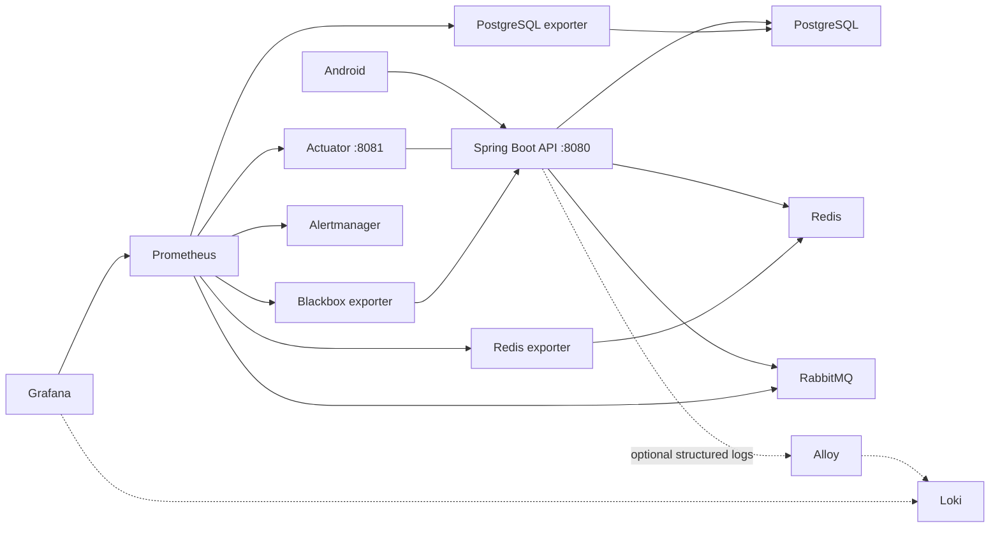

# EduFlex monitoring implementation plan

Status: monitoring MVP implemented on 2026-09-25; logs, load tests, and traces remain follow-up work.
Prepared: 2026-09-25. Scope: local Docker Compose first, reusable on a single Linux server.

## Goal and current state

Make it possible to answer: Is EduFlex available? Which requests are slow? Is the
database waiting on locks? Does Redis help? Are embedding jobs being processed?
Can an operator detect a failure, diagnose it, and verify recovery?

Repository findings:

- Spring Boot 3.4.2 / Java 17, with custom JWT security; no Actuator or Prometheus registry.
- `backend/docker-compose.yml` runs API, PostgreSQL 16 + pgvector, Redis, and RabbitMQ.
  Dependencies have health checks; the API has no Compose health check.
- Hikari defaults to 10 connections. Progress and reward writes serialize per learner
  in `GamificationStatsRepository.ensureAndLock`.
- `RedisConfig` declares cache TTLs but does not enable cache statistics.
- `ContentEmbeddingListener` consumes `content_embeddings_queue`.
  `ContentEventPublisher` sends after commit and logs publish failures; it has no
  transactional outbox. Monitoring cannot recover an event that was never delivered.
- `gamification_queue` is declared, but queue declaration alone does not establish an
  active worker. Audit consumers before creating consumer-count alerts for it.
- GitHub Actions already verifies backend tests and Android artifacts.

## Recommended stack and order

| Tool | EduFlex purpose | Priority |
| --- | --- | --- |
| Actuator + Micrometer | API, JVM, connection pool, cache and business metrics | MVP |
| Prometheus | Scrape metrics, retain history and evaluate alert rules | MVP |
| Grafana | Provisioned dashboards for API, dependencies and learning operations | MVP |
| PostgreSQL / Redis exporters | Database and cache server metrics | MVP |
| RabbitMQ Prometheus plugin | Broker and embedding queue metrics | MVP |
| Alertmanager | Group alerts, silence maintenance and route notifications | MVP |
| Blackbox exporter | Probe the actual API listener, beyond the management listener | MVP |
| Grafana Alloy + Loki | Centralized structured application logs | Follow-up |
| k6 | Repeatable performance baseline and contention experiments | After MVP |
| OpenTelemetry + Tempo | Request and asynchronous tracing | Later, if diagnosis needs it |
| node_exporter / cAdvisor | Linux host and container resource visibility | Server deployment |

Keep Docker Compose and the existing GitHub Actions workflow. Kubernetes, Jenkins,
and a framework migration are separate projects with no prerequisite role here.



## Phase 1: backend metrics and health

Files: `backend/pom.xml`, `backend/src/main/resources/application.properties`, new
`application-monitoring.properties`, `config/SecurityConfig.java`, `config/RedisConfig.java`,
and focused tests under `backend/src/test/java/com/eduflex/`.

1. Add `spring-boot-starter-actuator` and `micrometer-registry-prometheus`, using the
   existing Spring Boot dependency management. Do not upgrade the framework in this change.
2. Put remote scraping configuration in an opt-in `monitoring` Spring profile.
   Serve management on container port 8081, with only health and Prometheus exposed.
   Leave 8081 unpublished on the host. Disable unnecessary endpoints by default.
   In ordinary local runs, keep management on loopback with health-only exposure.
3. Add an ordered management security chain limited to the intended endpoints and
   management listener. Keep the existing API JWT chain and ownership rules intact.
   The local monitoring network may scrape without a learner JWT; all other
   management requests are denied. Prove `/actuator/prometheus` is inaccessible on 8080.
4. Define liveness using application availability, without database/broker dependency
   checks. Readiness includes PostgreSQL and Redis, which current request paths need.
   Show RabbitMQ health separately: broker failure should not mark every content API
   unavailable when publishing deliberately tolerates it. Document this tradeoff.
5. Expose a minimal readiness probe on the **8080 application listener**, with no
   sensitive health details, and probe that with Blackbox. A healthy management port
   alone does not prove the application's HTTP listener is functioning.
6. Collect built-in HTTP, JVM, GC and Hikari metrics; enable HTTP duration histograms
   for p95/p99 queries. Use stable application/environment tags and route templates.
7. Enable Redis cache statistics and verify actual exported per-cache hit/miss meters.
   These are process-local cache statistics, distinct from Redis server-wide counters.

Acceptance: an internal scrape returns valid metrics; API auth regressions pass;
health responses expose no credentials; metrics are unavailable through public API routes;
the application works when Prometheus/Grafana are stopped.

The integration approach follows [Spring Boot 3.4 metrics documentation](https://docs.spring.io/spring-boot/3.4/reference/actuator/metrics.html).
Validate properties against the installed 3.4.2 dependencies before committing.

## Phase 2: reproducible Compose monitoring

Add `backend/docker-compose.monitoring.yml` as an explicit overlay. Proposed command
from repository root, available only after implementation:

```bash
docker compose --env-file backend/.env \
  -f backend/docker-compose.yml \
  -f backend/docker-compose.monitoring.yml up --build -d
```

Proposed files:

```text
backend/monitoring/
  prometheus/prometheus.yml
  prometheus/rules/eduflex.yml
  prometheus/tests/eduflex.test.yml
  grafana/provisioning/datasources/prometheus.yml
  grafana/provisioning/dashboards/default.yml
  grafana/dashboards/{overview,dependencies,learning}.json
  alertmanager/alertmanager.yml
  blackbox/blackbox.yml
  rabbitmq/enabled_plugins
  postgres/setup-monitoring-role.sh
  postgres/queries.yml
backend/scripts/verify-monitoring.sh
docs/monitoring-runbook.md
```

- Pin all new images to reviewed versions/digests. Resolve compatible versions during
  implementation and record them; do not use `latest`. Avoid unrelated existing-image upgrades.
- Scrape every 15 seconds with a 10-second timeout; evaluate alerts every 15 seconds.
  Start with seven-day / 2 GB Prometheus retention limits, whichever is reached first.
  These are local defaults, not production sizing guarantees.
- Persist Prometheus, Grafana and Alertmanager data in separate named volumes.
  Define memory/CPU budgets after measuring `docker stats` during the baseline.
- Bind Grafana to `127.0.0.1:3000`, Prometheus to `127.0.0.1:9090`, and Alertmanager to
  `127.0.0.1:9093`. Keep exporters internal. Disable Grafana anonymous access and require
  credentials from untracked configuration. A server deployment needs authenticated TLS access.
- Enable `rabbitmq_prometheus` alongside the existing management plugin; scrape port
  15692. Check the existing RabbitMQ image's supported metric families. Enable only
  the necessary queue-level detail for embedding backlog and consumers, not all object labels.
- Use a dedicated PostgreSQL monitoring login with `pg_monitor` and required database
  access, never the application superuser credentials. Provide an idempotent setup
  script for existing volumes as well as fresh databases; initialization scripts only
  run automatically on first database creation. Apply collector-specific grants explicitly.
- Configure Redis exporter authentication without committing its password; never scan
  user cache keys or expose their contents. Report memory, evictions, clients and hits/misses.
- Add bounded, read-only PostgreSQL aggregate queries for lock waiters and long-running
  transactions if built-in collectors lack these signals. No SQL text or user IDs as labels.
- Add API and monitoring health checks using tools actually present in each image.
  Docker health checks report status; they do not themselves restart an unhealthy process.
- Provide an expected-target manifest so a removed scrape job cannot silently appear healthy.

Acceptance: each expected target is present and healthy after application traffic;
Grafana datasource and dashboards exist on a fresh startup; history survives a restart;
the original base Compose command still works without the overlay.

Use the [RabbitMQ monitoring guide](https://www.rabbitmq.com/docs/monitoring),
[PostgreSQL exporter documentation](https://github.com/prometheus-community/postgres_exporter),
and [Redis exporter documentation](https://github.com/oliver006/redis_exporter) for the
selected images' collector configuration and privileges.

## Phase 3: EduFlex-specific signals and dashboards

Instrument existing code using one small metrics component. Proposed meter names below
are contracts to implement; confirm exported names before writing dashboard queries.

| Signal | Instrumentation location | Meaning |
| --- | --- | --- |
| `eduflex_progress_completions_total{outcome}` | Lesson completion transaction | New completion versus already completed |
| `eduflex_reward_events_total{source}` | Reward transitions | Committed reward events by lesson/quiz/course/check-in/quest |
| `eduflex_stats_lock_acquisition_seconds` | `ensureAndLock` | Time for row initialization and lock acquisition, including SQL overhead |
| `eduflex_embedding_publish_total{outcome}` | `ContentEventPublisher` | Send calls returned versus send exceptions; not proof of broker confirmation |
| `eduflex_embedding_processing_seconds{outcome}` | `ContentEmbeddingListener` | Per-delivery attempt duration and success/failure |
| `eduflex_ai_requests_total{mode,outcome}` | `AiCourseService` | Provider/fallback use and outcomes |

Count successful business transitions after commit so rollbacks do not inflate success
metrics. Measure failures separately. Do not change transaction order, retry policy, or
reward eligibility to add instrumentation. Metrics counters are operational evidence,
not a durable reward ledger or proof that no event was lost.

Use bounded labels only: fixed outcomes, reward sources, cache names, configured queue
names. Never label by user/course/lesson IDs, email, JWT, full URLs, query text or prompt.

Provision three dashboards from version-controlled JSON with stable UIDs:

1. **Service overview:** API probe status, throughput, 5xx/4xx separately, p50/p95/p99
   latency, JVM heap and GC, Hikari usage/pending requests/timeouts, process restarts.
2. **Dependencies:** database connections, locks, deadlocks and long transactions;
   Redis memory/hits/misses/evictions; RabbitMQ memory/disk alarms, queue backlog,
   unacknowledged messages, consumer count and processing rate.
3. **Learning operations:** completion/retry rates, committed rewards, lock acquisition
   latency, embedding send failures and processing duration, AI fallback frequency.

Split normal API and AI-route latency panels. Exclude management/probe traffic from
user-facing request metrics. Display no-traffic/no-data explicitly. Test queries with
generated traffic; imported community dashboards must be adapted to observed metrics.
Version-controlled setup follows [Grafana provisioning](https://grafana.com/docs/grafana/latest/administration/provisioning/).

## Phase 4: actionable alerts and failure drills

Keep alert rules in Prometheus and notification routing in Alertmanager to avoid two
independent sets of rules. Start with these **provisional** thresholds, then tune with
the load baseline:

| Alert | Initial condition | First operator action |
| --- | --- | --- |
| API unavailable | Main-listener probe fails for 1 minute | Check process and readiness dependencies |
| Scrape missing/down | Expected target absent or `up == 0` for 1 minute | Check exporter, credentials, network |
| API errors | 5xx > 5% for 5 minutes, at least 100 requests/5 minutes | Inspect affected routes and logs |
| Slow normal API | p95 > 1 second for 5 minutes, same traffic floor | Inspect pool, locks and cache |
| Pool contention | Pending connections > 0 for 2 minutes, or timeout increase | Inspect long transactions before pool sizing |
| DB contention | Sustained lock waiters or new deadlocks | Identify blocking transaction via restricted DB access |
| Embedding backlog | Ready messages > 100 for 5 minutes | Compare consumers, processing rate and failures |
| Embedding worker absent | Backlog > 0 and consumers == 0 for 2 minutes | Check listener connection and startup |
| Embedding send failure | Send-exception counter increases | Inspect broker; assess stale embeddings |
| Resource pressure | Rabbit memory/disk alarm; Redis evictions increase | Check workload and capacity |

Do not interpret an absent series as zero. Initialize bounded custom counters and test
missing-data rules. Redis usage ratios require a nonzero configured maxmemory; otherwise
show bytes and an explicit unset limit. Do not invent a dead-letter-queue alert until
the project actually implements a DLQ.

Default local alerts should be visible in Alertmanager. Test delivery through a local
webhook recorder; configure external Slack/email only when the user supplies a desired
destination and authorizes delivery. Keep receiver credentials untracked.

Each alert needs severity, summary, dashboard link and a runbook action. Test pending,
firing and resolved states. Run stop/restart and consumer-backlog drills only in an
isolated test Compose project with disposable data. Preserve the developer's stack.

Limit: this single-host stack cannot notify during complete host failure by itself.
An independently hosted uptime check/receiver is a later production requirement.

## Phase 5: CI, documentation and acceptance

Update `.github/workflows/verify.yml` and README instructions together. Add a bounded
monitoring job that:

1. Validates merged Compose configuration with dummy CI secrets, without printing secrets.
2. Runs `promtool check config`, `promtool check rules`, and `promtool test rules`.
3. Validates Grafana JSON and starts an isolated monitoring stack with fresh volumes.
   Use a unique Compose project; remove/override fixed `container_name` and host-port
   collisions in the CI configuration. Do not reuse developer `.env` files or volumes.
4. Waits with a deadline for readiness, generates authenticated sample traffic, and
   checks every expected scrape target, datasource, dashboard UID, and representative metric.
5. Confirms metrics are unavailable through port 8080 and original 401/403 tests still pass.
6. Exercises one controlled outage and verifies alert firing and resolution. Tests with
   long alert windows belong in rule-unit tests to keep CI short.
7. Uploads sanitized logs/test reports on failure and always removes only the isolated
   CI project's containers and volumes.

Rule tests follow [Prometheus's documented test format](https://prometheus.io/docs/prometheus/latest/configuration/unit_testing_rules/).
Run all repository-required checks for backend/build/pipeline changes:

```bash
cd backend
./mvnw --batch-mode test
cd ..
./gradlew --no-daemon :app:lintDebug :app:assembleDebug :app:assembleRelease :app:bundleRelease
```

Use JDK 17/21 and Android SDK 35. Keep Firebase/signing material untracked. Do not
disable lint or release shrinking to pass verification. Report any environment block.

The runbook must include startup URLs, credentials setup, dashboard interpretation,
alert triage, retention/storage, exporter-role setup for existing databases, upgrade
procedure, and shutdown/recovery commands that preserve application data.

## Follow-up: logs, load tests and traces

- Add structured JSON application logs, request correlation IDs and redaction first.
  Ship rotated files from a shared log volume using Alloy with read-only access, avoiding
  unrestricted Docker socket access. Configure Loki retention explicitly; seven days
  is a starting local limit. Keep IDs in log fields rather than indexed labels.
  Use Alloy: [Promtail reached end of life on March 2, 2026](https://grafana.com/docs/loki/latest/send-data/promtail/).
- Add k6 scenarios for catalog cache cold/warm requests, mixed learners, and duplicate
  progress requests against one learner. Save workload, hardware, p95, error rate and
  contention results. The existing concurrency tests verify correctness, not throughput.
- Consider OpenTelemetry/Tempo after metrics and logs are useful. Verify context
  propagation through HTTP and RabbitMQ explicitly; async traces are not automatic.
  Keep sampling bounded and omit authorization headers, prompts and learner data.
- On Linux deployment, add host/container exporters. With Docker Desktop, clearly
  distinguish Linux VM measurements from the laptop host's resources.

## Suggested commits and completion checklist

1. `feat: expose restricted backend health and metrics`
2. `infra: add Prometheus Grafana and dependency exporters`
3. `feat: instrument learning operations and provision dashboards`
4. `ops: add alert rules runbooks and failure drills`
5. `ci: verify monitoring configuration and Compose smoke checks`
6. Optional later: `ops: centralize application logs with Alloy and Loki`

- [x] Fresh startup provisions monitoring without manual dashboard creation.
- [x] Existing data survives enabling/disabling monitoring through named volumes.
- [x] API, database, cache and queue metrics match generated activity.
- [x] All dashboards are provisioned and distinguish listener health from idle traffic.
- [x] Alert rules pass unit tests; a live API outage fired and resolved its alert.
- [x] Original auth, reward-concurrency and build checks pass.
- [x] README, runbook and CI verification are included with the monitoring features.

After delivery, a defensible CV bullet is: "Implemented Prometheus/Grafana monitoring
for a Spring Boot learning platform, including PostgreSQL, Redis and RabbitMQ metrics,
application dashboards, tested alert rules and reproducible Docker Compose deployment."
Add performance numbers only after recording the workload and measured results.
